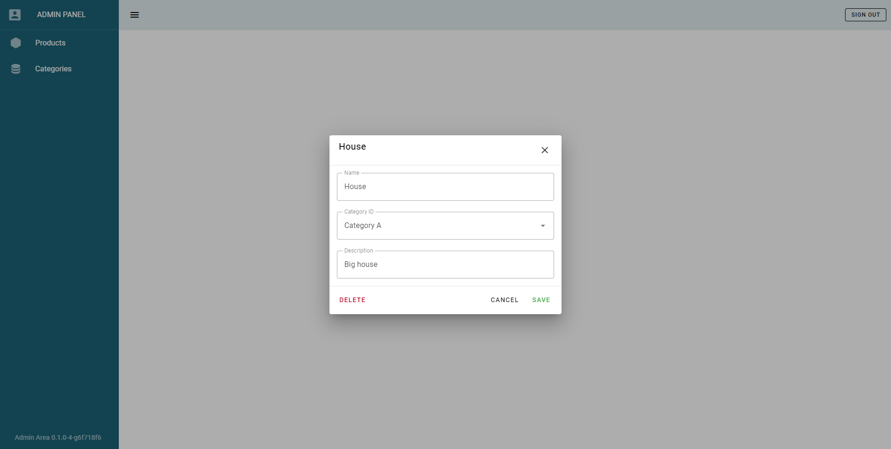
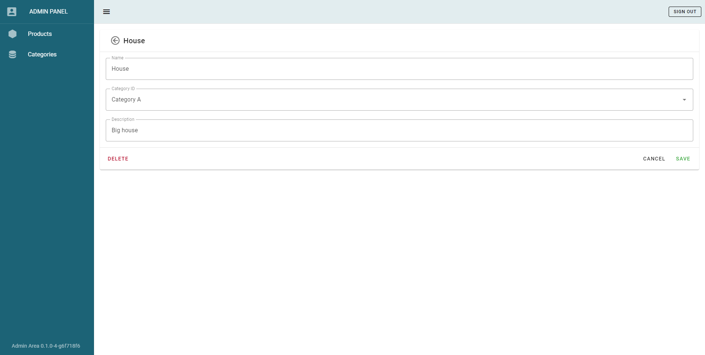

# CRUD Table Component

v1.2.0 (lacp-spa-2020 edition)

Component's goal is re-use of methods, structures and utilities for working with
list-based entities provided by CRUD endpoints.

<!-- START doctoc generated TOC please keep comment here to allow auto update -->
<!-- DON'T EDIT THIS SECTION, INSTEAD RE-RUN doctoc TO UPDATE -->


- [Core parts](#core-parts)
    - [Rendering](#rendering)
    - [Store](#store)
    - [Endpoint loader](#endpoint-loader)
    - [Mapper from/to DTO](#mapper-fromto-dto)
- [Getting started](#getting-started)
  - [Adding new Entity](#adding-new-entity)
- [Entity Table Component](#entity-table-component)
  - [API](#api)
  - [Setting custom filters or header components](#setting-custom-filters-or-header-components)
  - [Advanced: Rendering components inside table column](#advanced-rendering-components-inside-table-column)

<!-- END doctoc generated TOC please keep comment here to allow auto update -->

## Core parts

#### Rendering

Base - [`EntityTable.vue`](../src/components/common/EntityTable.vue)

- Based on Vuetify [Data Table](https://vuetifyjs.com/en/components/data-tables/basics/) - This component is currently experimental
- Features:
  - Pagination
  - Search (Beta)
  - Sorting
  - Customization
    - [Setting custom filters or header components](#setting-custom-filters--header-components)
    - [Rendering inline components inside table column](#advanced-rendering-components-inside-table-column)
    - Editing of entity is completed via custom component and router (both inline and
      separate component)
- Each entity component is located in `src/components/entities/`
- Usage:
  - import `EntityTable.vue`
  - configure, see [Entity Table API](#api)
- Sample: [`ProductTable.vue`](../src/components/entities/products/ProductTable.vue)

#### Store

Base - [`CrudModule`](../src/store/entityModules/CrudModule.ts)

- Based on default Vuex
- Features:
  - Store loaded items, total number of items, the current edit (selected) item, loading
    properties
  - Store query filters - pagination, sorting, search, etc
  - Store entity type to:
    - determine API client and mapper instances for this entity
    - generate human readable error/success messages
  - Actions to load and parse the data list or single entity, update/add/delete entity
  - Actions to edit query filters
  - Getters to retrieve data & filters
- Each entity Store is located in `src/store/entityModules` and extends `CrudModule`
- Sample: [`ProductsModule`](../src/store/entityModules/ProductsModule.ts)

#### Endpoint loader

Base - [`CrudEndpoint`](../src/api/common/CrudEndpoint.ts)

- Features:
  - Performs actual network operations
  - Uses global Axios [setup](../src/api/common/Axios.ts)
- All API clients are located in `src/api/endpoints` and extend `CrudEndpoint`
- Sample: [`ProductCRUD`](../src/api/endpoints/ProductCRUD.ts)

#### Mapper from/to DTO

Base - [`Mapper`](../src/models/mappers/Mapper.ts)

- All mappers are located in `src/models/mappers` and extend `Mapper`
- Sample: [`ProductMapper`](../src/models/mappers/ProductMapper.ts)

## Getting started

### Adding new Entity

Prerequisites:

1. EntityClass located in [`models/entities`](../src/models/entities)
2. EntityDTO located in [`api/dto`](../src/api/dto)
3. Mapper for entity is implemented (see [above](#endpoint-loader))
4. API client for entity is implemented (see [above](#mapper-fromto-dto))

Steps:

1. Add new value to [`EntityType`](../src/store/entityModules/types.ts)

   1. Value has to be an all lower-case singular noun (e.g. 'product', 'category')
   2. It will used to get API client, mapper from store and path to module from components

2. Connect entity to mapper & API client:
   1. Add corresponding switch case to
      [`getEntityMapper()`](../src/models/mappers/utils.ts) to connect new `EntityType`
      and specific mapper
   2. Add corresponding switch case to
      [`getEntityApiClient()`](../src/api/utils/GetClient.ts) to connect new `EntityType`
      and specific endpoint loader
3. Define new store module. It must extend `CrudModule`:

   ```ts
   class EntityModule extends CrudModule<EntityClass, EntityDTO>
   ```

   1. Override entity type value with the new one you just added to `EntityType`

      ```ts
      state: IModuleState<EntityClass, EntityDTO> = {
       ...this.state,
       entityType: EntityType.<TYPE>
      };
      ```

   2. Create instance of module and export it

4. Add created module to store. In `src/store/Store.ts` add the following lines:

   1. Import created module:

      ```ts
      import { entity_module } from '{path_to_module}';
      ```

   2. In the `modules` prop:

      ```ts
       {module_name}: {entity_module}
      ```

   3. Add corresponding switch case to
      [`getEntityStorePath()`](../src/store/entityModules/utils.ts) to connect new
      `EntityType` and `{module_name}`

5. Create new Vue component with Table:

   ```vue
   <EntityTable entity-type="{entity_type}" :headers="state.headers"></EntityTable>
   ```

   Where:

   - `entity_type` is the name of new EntityType
   - `headers` is a component state variable (see example in
     [`ProductTable.vue`](../src/components/entities/products/ProductTable.vue))

6. Create new Vue component with EntityDialog or EntityPage:

   1. In order to be able to edit an item, you need to use the [`EntityDialog`](../src/components/common/EntityDialog.vue) or [`EntityPage`](../src/components/common/EntityPage.vue)  component

   2. For the correct operation of the component, added a new [`route`](../src/router/secondaryRoutes.ts) with a reference to this file

Below you can see the difference between EntityDialog and EntityPage. In general, the difference is in the markup and that the EntityPage is displayed in a separate page

    
   [`EntityDialog`](../src/components/common/EntityDialog.vue) 	↑
   
   [`EntityPage`](../src/components/common/EntityPage.vue)	↑
   
## Entity Table Component

### API

`<EntityTable>` component needs the following params to be passed:

- `entity-type` - type of entity (to calculate path to entity module, use it to dispatch
  actions, for routing and pass down to sub-components)
- `headers` - the list of headers (type `TableHeader`) for the current Entity

### Setting custom filters or header components

1. There are two table slot available to display components in the header:
   1. `top-left`
   2. `top-right`
2. You can create new filter components to pass to slots
3. If you don't pass anything to slots, default components will be used:
   1. [`Search`](../src/components/utils/SearchBar.vue) component in `top-left`
      1. Search needs to be implemented on backend for it to function properly
   2. `New Item` button in `top-right`

### Advanced: Rendering components inside table column

1. Set header property `editable` to `true`.
2. Pass desired component to table using slots:
   1. Slot name is the same as header's `value`
   2. To pass item values as props to component bind `item` to the slot
3. Example:

   - custom `div` element that formats `item.total` value to display as currency

   ```vue
   <template v-slot:total="{ item }">
     <div>{{ formatCurrency(item.total) }}</div>
   </template>
   ```
   
